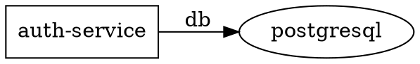
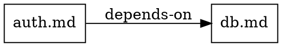

# BMD Knowledge System — Command Reference

Complete reference for the agent-queryable knowledge system CLI commands.

## Overview

The knowledge system provides programmatic access to markdown documentation through CLI commands. Each command indexes, searches, or analyzes markdown files.

### Prerequisites

```bash
# First, build an index
bmd index /path/to/docs

# This creates knowledge.db in the current directory
# Subsequent commands use this index
```

---

## Command: `index`

Build or rebuild the knowledge index.

### Syntax
```bash
bmd index [DIR]
```

### Arguments
| Argument | Type | Required | Description |
|----------|------|----------|-------------|
| `DIR` | path | No | Directory to index (default: current directory) |

### Examples

```bash
# Index current directory
bmd index

# Index specific directory
bmd index /path/to/documentation
bmd index ~/projects/docs

# Index project with complex structure
bmd index .
# Creates ./knowledge.db
```

### Output

```
Scanning directory...
Found 47 markdown files
Building BM25 index... [████████░░] 80%
Extracting relationships...
Building knowledge graph...
Saving to knowledge.db (2.3 MB)

Index complete:
  Documents: 47
  Terms: 1,234
  Relationships: 156
```

### Notes

- Scans recursively for `.md` files
- Skips hidden directories (`.`, `..`, etc.)
- Indexes document content, links, and code references
- Creates `knowledge.db` in the working directory
- Idempotent: safe to run multiple times
- Updates existing index (fast incremental mode)

---

## Command: `query`

Search for content using full-text search.

### Syntax
```bash
bmd query TERM [--dir DIR] [--format FORMAT] [--top N]
```

### Arguments

| Argument | Type | Default | Description |
|----------|------|---------|-------------|
| `TERM` | string | Required | Search term or phrase |
| `--dir` | path | `.` | Directory to search (must be indexed first) |
| `--format` | string | `text` | Output format: `json`, `text`, `csv` |
| `--top` | number | `10` | Maximum results to return |

### Examples

```bash
# Simple search
bmd query "async patterns"

# Search in specific directory
bmd query "authentication" --dir ~/docs

# Get top 5 results
bmd query "microservices" --top 5

# Output as JSON (for piping to other tools)
bmd query "router" --format json

# CSV output (for spreadsheet import)
bmd query "API" --format csv
```

### Output Formats

**Text (default):**
```
Results for "async patterns" (5 matches):

1. advanced-patterns.md (score: 1.23)
   Line 142: "Handling async patterns in Node.js"

2. architecture.md (score: 1.01)
   Line 87: "Async patterns enable concurrent processing"

3. tutorial.md (score: 0.87)
   Line 56: "Learn async patterns with promises"
```

**JSON:**
```json
{
  "query": "async patterns",
  "count": 5,
  "results": [
    {
      "file": "advanced-patterns.md",
      "score": 1.23,
      "line": 142,
      "snippet": "Handling async patterns in Node.js"
    }
  ]
}
```

**CSV:**
```
file,score,line,snippet
advanced-patterns.md,1.23,142,"Handling async patterns in Node.js"
architecture.md,1.01,87,"Async patterns enable concurrent processing"
```

### Notes

- Uses BM25 ranking algorithm
- Scores are relative relevance (higher = more relevant)
- Searches indexed documents only (run `bmd index` first)
- Case-insensitive matching
- Phrase queries supported: `"exact phrase"`

---

## Command: `depends`

Find service dependencies.

### Syntax
```bash
bmd depends SERVICE [--format FORMAT]
```

### Arguments

| Argument | Type | Default | Description |
|----------|------|---------|-------------|
| `SERVICE` | string | Required | Service name to analyze |
| `--format` | string | `text` | Output format: `json`, `text`, `dot` |

### Examples

```bash
# Find direct dependencies
bmd depends auth-service

# Get JSON for programmatic use
bmd depends users-api --format json

# Export Graphviz diagram
bmd depends api-gateway --format dot > diagram.dot
dot -Tpng diagram.dot -o diagram.png
```

### Output Formats

**Text (default):**
```
Dependencies of: auth-service

Direct Dependencies (1 hop):
  ✓ postgresql (via database connection)
  ✓ redis-cache (via caching layer)

Transitive Dependencies (all hops):
  ✓ users-api → auth-service → postgresql
  ✓ payments-api → auth-service → redis-cache

Dependency Chain (longest path):
  users-api → auth-service → postgresql (3 hops)
```

**JSON:**
```json
{
  "service": "auth-service",
  "direct": ["postgresql", "redis-cache"],
  "transitive": [
    ["users-api", "auth-service", "postgresql"],
    ["payments-api", "auth-service", "redis-cache"]
  ],
  "longest_chain": {
    "path": ["users-api", "auth-service", "postgresql"],
    "length": 3
  }
}
```

**DOT (Graphviz):**


### Notes

- Detects circular dependencies
- Returns shortest and longest paths
- Confidence scores included in JSON
- DOT format for visualization with Graphviz

---

## Command: `services`

List all detected components.

### Syntax
```bash
bmd components [--format FORMAT]
```

### Arguments

| Argument | Type | Default | Description |
|----------|------|---------|-------------|
| `--format` | string | `text` | Output format: `json`, `text` |

### Examples

```bash
# List all components
bmd components

# Get as JSON
bmd components --format json

# Pipe to jq for filtering
bmd components --format json | jq '.components[] | select(.confidence > 0.8)'
```

### Output Formats

**Text (default):**
```
Detected Components (8 total):

1. auth-component (confidence: 0.95)
   - Endpoints: POST /auth/login, POST /auth/logout, GET /auth/verify
   - Dependencies: postgresql, redis

2. users-api (confidence: 0.92)
   - Endpoints: GET /users, POST /users, GET /users/:id
   - Dependencies: auth-component, postgresql

3. payments-api (confidence: 0.88)
   - Endpoints: POST /payments, GET /payments/:id
   - Dependencies: users-api, stripe-api

...
```

**JSON:**
```json
{
  "components": [
    {
      "name": "auth-component",
      "confidence": 0.95,
      "type": "api",
      "endpoints": [
        {"method": "POST", "path": "/auth/login"},
        {"method": "POST", "path": "/auth/logout"}
      ],
      "dependencies": ["postgresql", "redis"]
    }
  ],
  "total": 8
}
```

### Notes

- Confidence score indicates detection reliability
- Components are detected from:
  - Filename patterns (e.g., `components/auth-component/`)
  - Headings (e.g., "## Auth Component")
  - In-degree in dependency graph
  - Optional `components.yaml` config
- Confidence >0.8 is high confidence
- Confidence <0.5 may be false positives

---

## Command: `graph`

Export the knowledge graph.

### Syntax
```bash
bmd graph [--format FORMAT]
```

### Arguments

| Argument | Type | Default | Description |
|----------|------|---------|-------------|
| `--format` | string | `text` | Output format: `json`, `dot` |

### Examples

```bash
# View graph as text
bmd graph

# Export to Graphviz
bmd graph --format dot > graph.dot
dot -Tpng graph.dot -o graph.png

# Export to JSON for analysis
bmd graph --format json > graph.json
```

### Output Formats

**Text (default):**
```
Knowledge Graph (47 nodes, 156 edges):

Nodes:
  ✓ authentication.md (in: 4, out: 3)
  ✓ api-reference.md (in: 12, out: 2)
  ✓ architecture.md (in: 1, out: 8)
  ...

Edges:
  references: 87 (high confidence)
  depends-on: 34 (code references)
  calls: 22 (API calls)
  mentions: 13 (text references)

Cycles Detected: 2
  Cycle 1: api.md → utils.md → api.md
  Cycle 2: service-a.md → service-b.md → service-a.md
```

**JSON:**
```json
{
  "nodes": [
    {
      "id": "auth.md",
      "type": "document",
      "in_degree": 4,
      "out_degree": 3
    }
  ],
  "edges": [
    {
      "source": "auth.md",
      "target": "db.md",
      "type": "depends-on",
      "confidence": 0.9
    }
  ],
  "cycles": [
    ["api.md", "utils.md", "api.md"]
  ]
}
```

**DOT (Graphviz):**


### Notes

- Shows relationship types and confidence scores
- Useful for architecture visualization
- Detects cycles (circular dependencies)
- Large graphs may need preprocessing with Graphviz options
- Use `--format json` for programmatic analysis

---

## Output Format Details

### JSON Schema

All JSON output follows a consistent schema:

```json
{
  "command": "query|depends|services|graph",
  "status": "success|error",
  "timestamp": "2026-02-28T10:30:00Z",
  "data": {}
}
```

### Error Handling

```bash
# Invalid service name
$ bmd depends nonexistent-service
Error: Service "nonexistent-service" not found
Available services: auth-service, users-api, ...

# Index not found
$ bmd query "test"
Error: knowledge.db not found
Run: bmd index /path/to/docs

# Invalid directory
$ bmd index /nonexistent/path
Error: Directory not found: /nonexistent/path
```

---

## Integration Examples

### Bash Script: List All Components and Count Dependencies

```bash
#!/bin/bash
bmd components --format json | jq -r '.components[] | "\(.name): \(.dependencies | length) deps"'
```

### Python: Find Components with High In-Degree

```python
import json
import subprocess

result = subprocess.run(['bmd', 'graph', '--format', 'json'], capture_output=True, text=True)
graph = json.loads(result.stdout)

high_degree = [n for n in graph['nodes'] if n['in_degree'] > 5]
for node in high_degree:
    print(f"{node['id']}: {node['in_degree']} incoming dependencies")
```

### Graphviz: Visualize Architecture

```bash
# Export and visualize
bmd graph --format dot | dot -Tpng -o architecture.png

# Or with Graphviz options for large graphs
bmd graph --format dot | neato -Goverlap=scale -Tpng -o architecture.png
```

---

## Performance Tips

1. **Build once, query many:** Run `bmd index` once, then execute multiple queries
2. **Use --top N:** Limit results for large indexes
3. **Filter with jq:** Use `bmd query ... --format json | jq '.results[:5]'`
4. **Cache results:** For CLI tools, store JSON output and parse locally

---

## Troubleshooting

| Issue | Solution |
|-------|----------|
| "knowledge.db not found" | Run `bmd index` first |
| Empty results | Check document format (must be `.md`) |
| Slow queries | Run `bmd index` again to refresh |
| High confidence issues | Adjust heuristics in `internal/knowledge/services.go` |
| Memory usage | Reduce number of documents indexed |

---

## Watch Mode (Phase 18)

### bmd watch

Monitor a directory for .md file changes and update indexes incrementally.

```
bmd watch [--dir DIR] [--interval-ms N]
```

Options:
- `--dir DIR` — Directory to watch (default: current directory)
- `--interval-ms N` — Poll interval in milliseconds (default: 500)

Prints change events to stderr as they arrive. Press Ctrl+C to stop.

Example:
```
bmd watch --dir ./docs
```

### MCP Watch Tools (bmd serve --mcp)

Three MCP tools are available for agent-driven watching:

| Tool | Description |
|------|-------------|
| `bmd/watch_start` | Start watching a directory. Returns `session_id`. |
| `bmd/watch_poll` | Poll for pending change notifications since last poll. |
| `bmd/watch_stop` | Stop an active watch session. |

#### bmd/watch_start
```json
{ "dir": "./docs", "interval_ms": 500 }
→ { "session_id": "ws-1234567890", "dir": "/abs/path", "status": "watching" }
```

#### bmd/watch_poll
```json
{ "session_id": "ws-1234567890" }
→ { "notifications": [{"kind": "modified", "rel_path": "api.md"}], "count": 1 }
```

#### bmd/watch_stop
```json
{ "session_id": "ws-1234567890" }
→ { "status": "stopped" }
```

---

See [README.md](README.md) for viewer features and [QUICKSTART.md](QUICKSTART.md) for quick examples.
