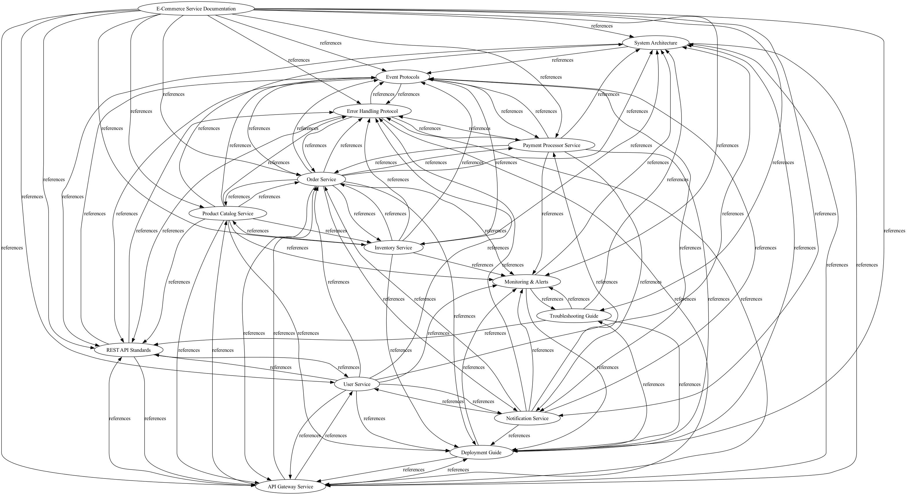
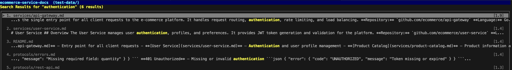
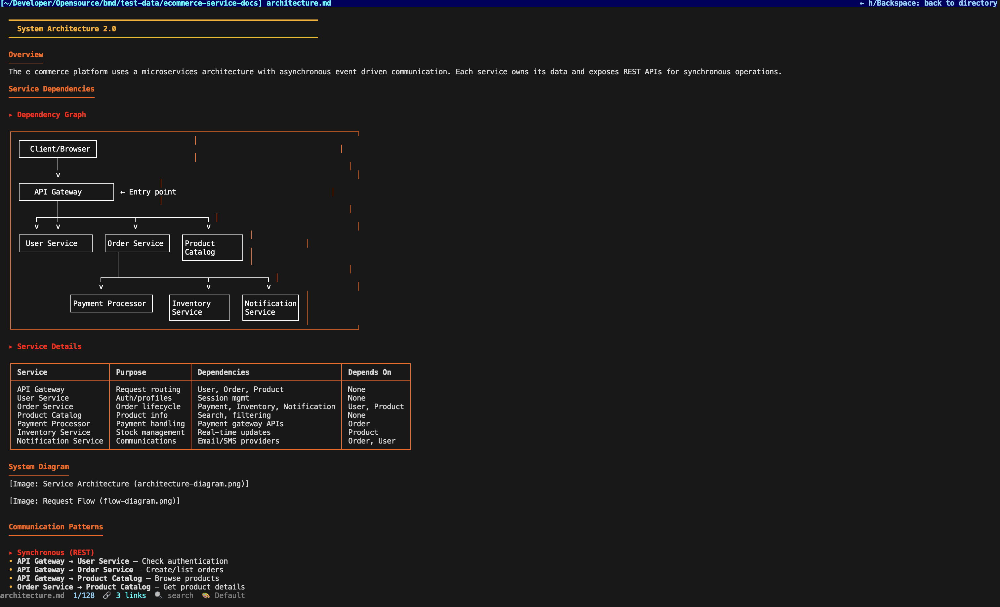
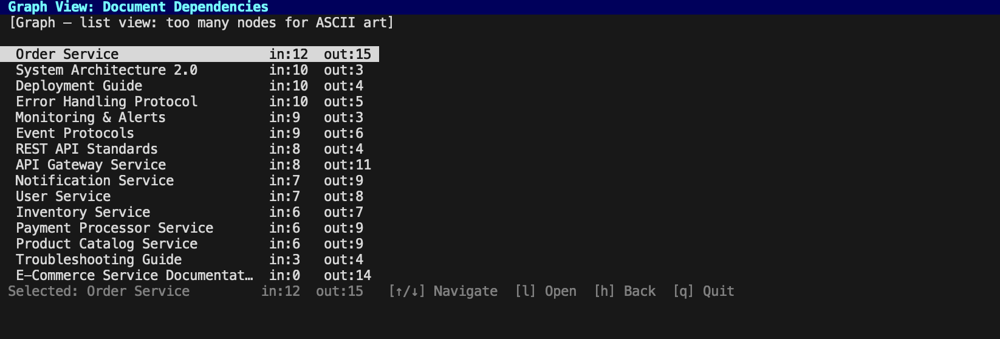

# BMD — Beautiful Markdowns

A powerful, beautiful terminal-based markdown editor with integrated knowledge graph capabilities, full-text search, and **agent-queryable documentation interface**. Perfect for both humans editing markdown and AI agents analyzing documentation at scale.

**For humans:** Edit and view markdown files with stunning formatting, syntax highlighting, and semantic relationship analysis — all without leaving the CLI.

**For agents:** Query, search, and analyze documentation programmatically. Build knowledge graphs, detect components, understand architecture relationships, and integrate with agent frameworks via MCP.

---

## Installation

### For Humans (Simple Install)

**One-line installer:**
```bash
curl -fsSL \
  https://github.com/vaibhav1805/bmd/releases/latest/download/install.sh \
  | bash
```

This script:
- Detects your OS (macOS, Linux, Windows) and architecture (arm64, x86_64)
- Downloads the latest release binary and renames it to `bmd`
- Downloads the `pageindex` wrapper script (optional, for semantic search)
- Places both in `$HOME/.local/bin`
- Adds to PATH automatically if needed

Both `bmd` and `pageindex` will be ready to use immediately after installation.

**Or build from source:**
```bash
# Clone the repository
git clone https://github.com/vaibhav1805/bmd
cd bmd

# Build the binary
go build -o bmd ./cmd/bmd

# Install to PATH
sudo mv bmd /usr/local/bin/

# Or locally:
mkdir -p ~/.local/bin
mv bmd ~/.local/bin/
export PATH="$HOME/.local/bin:$PATH"
```

### PageIndex Wrapper (For Semantic Search)

The `pageindex` wrapper script is **automatically installed** with the one-line installer. It enables semantic search with hierarchical markdown indexing.

**What's installed:**
```bash
~/.local/bin/pageindex  # Python wrapper for hierarchical indexing
```

**Verify installation:**
```bash
pageindex --help
# Should show: usage: pageindex [-h] {index,query} ...
```

**Manual installation** (if needed):
```bash
# Option 1: Download from GitHub
curl -fsSL https://raw.githubusercontent.com/vaibhav1805/bmd/main/bin/pageindex.py \
  -o ~/.local/bin/pageindex
chmod +x ~/.local/bin/pageindex

# Option 2: Ensure Python 3 is installed
python3 --version  # Should be 3.6+
```

**For agents and advanced PageIndex configuration**, see **[AGENT.md](./AGENT.md)** for:
- Semantic search with reasoning traces
- Custom LLM models
- MCP server configuration
- Integration with agent frameworks
- Troubleshooting

## Quick Overview

### As an Editor
```bash
# View/edit markdown files with beautiful rendering
bmd README.md        # View mode
# Press 'e' to enter edit mode

# Index your documentation (one-time setup for search)
bmd index ./docs                    # Build BM25 index

# Search within document (while viewing)
bmd README.md
# Press '/' to search within the file, or Ctrl+F in edit mode

# Search across all markdown files in directory
bmd query "topic" --dir ./docs              # Keyword search across files
```

### Export & Deploy Knowledge

**Package knowledge for distribution:**
```bash
# Export documentation + indexes as portable tar
bmd export --from ./docs --output knowledge.tar.gz --version 1.0.0

# Import in a new location
bmd import knowledge.tar.gz --dir /tmp/knowledge

# Run headless for agents (no TUI)
bmd serve --headless --mcp --knowledge-tar knowledge.tar.gz

# Publish to cloud storage
bmd export --from ./docs --publish s3://my-bucket/knowledge
bmd import s3://my-bucket/knowledge-v1.0.0.tar.gz
```

**Deploy in containers:**
```bash
# Build Docker image with embedded knowledge
docker build -t bmd-service .

# Run with Docker Compose (agent + BMD sidecar)
docker-compose up

# Deploy to Kubernetes
kubectl apply -f kubernetes/
```

### For Agents

BMD provides a complete knowledge system for AI agents: full-text search, semantic retrieval, graph analysis, and MCP server integration.

🤖 **See [AGENT.md](./AGENT.md) for:**
- Agent command reference (`bmd query`, `bmd context`, `bmd depends`, `bmd graph`, `bmd crawl`)
- MCP server setup for seamless integration
- Export/import for containerized workflows
- Integration examples (LangChain, Python, Node.js)
- Configuration for semantic search with PageIndex


*Browse markdown files with live preview. Navigate with arrow keys, press 's' to toggle split-pane view.*

### Features

**Editing & Viewing:**
- ✏️ **Edit Mode** — Syntax-highlighted markdown editing with file persistence
- 🎨 **Beautiful rendering** — Styled headings, code blocks, tables, lists
- 🖱️ **Mouse support** — Click to navigate, select text, follow links
- 📋 **Link navigation** — Follow markdown links between files
- 🔍 **Full-text search** — BM25-ranked search within documents
- 🎯 **Jump to line** — Use `:N` to jump to specific lines
- 🎨 **Color themes** — 5 built-in themes (Default, Ocean, Forest, Sunset, Midnight)

**Agent Tools:**
- 🤖 **Knowledge graphs** — Build dependency graphs, query component architecture
- 📊 **Full-text indexing** — BM25 search across documentation
- 🧠 **Semantic search** — LLM-powered intent-based retrieval (PageIndex)
- 🔗 **Component detection** — Automatically identify services and dependencies
- 💾 **Local persistence** — SQLite-based indexing for fast queries
- 📤 **Multiple formats** — JSON, text, CSV, Graphviz output

**Terminal & Display:**
- 🌐 **Image rendering** — Terminal image support (iTerm2, Kitty, Alacritty, Sixel with ImageMagick)
- 📊 **Native graph visualization** — Dependency graphs as native graphics (Graphviz) or ASCII art fallback
- ⌨️ **Vim keybindings** — Familiar shortcuts for efficient navigation
- 📂 **Directory browser** — *(Beta)* Browse and search markdown files in split-pane view
- 🚀 **Zero dependencies** — Pure Go stdlib, single binary

## Installation

```bash
# Clone and build
git clone https://github.com/vaibhav1805/bmd
cd bmd
go build -o bmd ./cmd/bmd

# Install to PATH (optional)
sudo mv bmd /usr/local/bin/
```

## Usage

### Basic Viewing
```bash
bmd README.md              # Open in view mode
bmd                        # Open directory browser (auto-detect .md files)
```

### Edit Mode
```bash
bmd document.md
# Press 'e' to enter edit mode
# Edit with syntax highlighting
# Press Esc to exit, file auto-saves
```

### Directory Browser *(Beta)*
```bash
bmd                    # Enter directory browser in split-pane mode
# Or toggle with 's' key while browsing
# Navigate with ↑/↓, press 'l' to open, 'h' to go back
```

### Search & Indexing

**For human editors:**
```bash
# Search within a file
bmd README.md
# Press '/' for forward search, '?' for backward search, n/N for next/prev

# Search across all markdown files
bmd query "topic" --dir ./docs
```

**For agents and advanced search:**
📚 See [AGENT.md — Querying & Analysis](./AGENT.md#commands) for:
- Full-text search with BM25 ranking
- Semantic search with PageIndex (LLM-powered)
- Service/component detection
- Dependency graph analysis
- Multi-start graph traversal
- RAG-ready context assembly

## Configuration & Settings

### Human Editor Configuration

```bash
# Editor theme (default, ocean, forest, sunset, midnight)
export BMD_THEME="ocean"

# Enable/disable features
export BMD_MOUSE_ENABLED="true"
export BMD_SYNTAX_HIGHLIGHTING="true"

# Terminal image protocol (auto, kitty, iterm2, sixel, unicode)
export BMD_IMAGE_PROTOCOL="auto"
```

### Config File (.bmd-config.yaml)

Create `.bmd-config.yaml` in your documentation root for persistent settings:

```yaml
# Display settings for humans
theme: default                   # default, ocean, forest, sunset, midnight
mouse_enabled: true              # Enable mouse for link clicking, text selection
syntax_highlighting: true        # Enable syntax coloring in code blocks
auto_index: true                 # Index on startup if .bmd-index.json missing

# Indexing
index_frequency: "1h"            # How often to auto-reindex (5m, 15m, 1h, 1d, none)

# Ignore patterns (like .gitignore)
ignore_patterns:
  - node_modules
  - .git
  - __pycache__
  - .venv
  - dist
  - build

# Logging
log_level: info                  # debug, info, warn, error
```

### For Agents

For agent-specific configuration including strategy selection, output formats, PageIndex settings, MCP server configuration, and advanced indexing options:

📋 **See [AGENT.md — Configuration for Agents](./AGENT.md#configuration-for-agents)**

## Keyboard Shortcuts

**Navigation:**
- `j/k` or `↓/↑` — Scroll down/up
- `gg` — Jump to top
- `G` — Jump to bottom
- `:N` — Jump to line N
- `Backspace` — Go back to previous file

**Search:**
- `/` — Search forward
- `?` — Search backward
- `n/N` — Next/previous match

**Editing (Edit Mode):**
- `e` — Enter edit mode
- `Esc` — Exit edit mode
- `Ctrl+S` — Save
- `Ctrl+Z/Y` — Undo/Redo
- `Ctrl+F` — Find within document

**Viewing:**
- `Tab` — Navigate to next link
- `Enter` — Follow highlighted link
- `t` — Cycle themes
- `h/?` — Show help
- `q` — Quit

**Directory Browser:**
- `s` — Toggle split-pane mode *(Beta)*
- `↑/↓` — Navigate files
- `l/Enter` — Open file
- `h/Backspace` — Back to directory
- `/` — Search across files
- `g` — View dependency graph

## Knowledge System (For Agents)


*BM25-ranked search across all files with highlighted matches and context snippets*

Beyond editing, BMD can index markdown directories and answer architectural questions
programmatically.

### Building an Index
```bash
bmd index /path/to/docs
```

Creates `.bmd-index.json` and `.bmd-graph.json` with:
- Full-text search index (BM25)
- Knowledge graph (document relationships)
- Microservice detection
- Dependency analysis

### Command Reference

| Command | Purpose | Example |
|---------|---------|---------|
| `index [DIR]` | Build knowledge index | `bmd index ./docs` |
| `index [DIR] --strategy pageindex` | Index with semantic trees | `bmd index ./docs --strategy pageindex` |
| `query TERM [--dir PATH]` | Full-text search (BM25) | `bmd query "router"` |
| `query TERM [--dir PATH] --strategy pageindex` | Semantic search with reasoning | `bmd query "how do we handle errors?" --dir ./docs --strategy pageindex` |
| `context TERM [--dir PATH]` | Assemble RAG context blocks | `bmd context "auth flow" --dir ./docs` |
| `depends SERVICE [--format json\|text\|dot]` | Find dependencies | `bmd depends api-gateway` |
| `components [--format json\|text]` | List detected components | `bmd components` |
| `graph [--format json\|dot]` | Export relationship graph | `bmd graph --format dot` |
| `crawl --from-multiple FILE[,FILE] [--direction] [--depth] [--format]` | Multi-start graph traversal | `bmd crawl --from-multiple api.md --direction forward` |


## Troubleshooting

### General Issues

#### "bmd: command not found"

The binary isn't in your PATH. Fix with:

```bash
# Find where bmd was installed
which bmd
find ~ -name bmd -type f 2>/dev/null

# Add to PATH (add to ~/.bashrc, ~/.zshrc, or ~/.config/fish/config.fish)
export PATH="$HOME/.local/bin:$PATH"

# Or move to a PATH directory
sudo mv ~/Downloads/bmd /usr/local/bin/
```

#### Terminal display issues (garbled colors, wrong layout)

Try these in order:

```bash
# 1. Check terminal width
echo $COLUMNS
# If < 80, your terminal is too narrow

# 2. Reset terminal
reset

# 3. Disable mouse if causing issues
bmd --no-mouse file.md

# 4. Try with explicit TERM
TERM=xterm-256color bmd file.md

# 5. Check for conflicting aliases
alias | grep bmd
type bmd  # Shows which bmd is used

# 6. Disable mouse in config
echo "mouse_enabled: false" >> ~/.bmd-config.yaml
```

#### Performance issues (slow rendering or indexing)

```bash
# Check if index exists
ls -lh .bmd-index.json

# Rebuild index (fresh)
rm .bmd-index.json
bmd index ./docs

# For large directories (1000+ files), use BM25
export BMD_STRATEGY="bm25"
bmd query "topic" --dir ./docs

# Profile indexing
time bmd index ./docs

# Check file count
find . -name "*.md" | wc -l

# If > 10k files, consider splitting documentation
```

**For agent-specific issues:** See [AGENT.md — Troubleshooting for Agents](./AGENT.md#troubleshooting-for-agents) for:
- INDEX_NOT_FOUND errors
- PageIndex binary not found
- MCP server issues
- JSON parsing errors
- Docker integration

#### PageIndex binary not found

If you see `"pageindex executable not found"` when using semantic search:

```bash
# Check if pageindex is installed
which pageindex

# If not found, install it
curl -fsSL https://raw.githubusercontent.com/vaibhav1805/bmd/main/bin/pageindex.py \
  -o ~/.local/bin/pageindex
chmod +x ~/.local/bin/pageindex

# Verify Python 3 is available
python3 --version

# Test pageindex
pageindex index --help
```

### Human Editor Issues

#### Edit mode not working

```bash
# Check if keyboard input is enabled
bmd file.md --no-mouse  # Disable mouse, keep keyboard

# Try with explicit terminal
TERM=xterm-256color bmd file.md

# Verify file permissions
ls -la file.md
# Should be readable/writable by you

# Check disk space
df -h  # Ensure you have space to save
```

#### Changes not saving

```bash
# Verify file is writable
chmod u+w file.md

# Check directory permissions
touch .test && rm .test  # Can write to this directory?

# Try saving to a different location
bmd file.md
# In editor: Ctrl+S to save
# Check if .md.bak or .md.tmp exists

# Manual check
cat file.md  # Does it have your changes?
```

#### Cursor position wrong

```bash
# This is a known issue with ANSI escape codes in the terminal
# Workaround: Disable syntax highlighting
echo "syntax_highlighting: false" >> .bmd-config.yaml
bmd file.md

# Or use BM25 search instead of PageIndex semantic search
export BMD_STRATEGY="bm25"
```

### Linux-Specific Issues

#### Images not rendering on Linux

```bash
# Check TERM variable
echo $TERM

# If not set, use explicit terminal
TERM=xterm-256color bmd file.md

# Try different image protocols
export BMD_IMAGE_PROTOCOL="kitty"    # For Kitty terminal (best)
export BMD_IMAGE_PROTOCOL="sixel"    # For xterm/mlterm (requires ImageMagick)
export BMD_IMAGE_PROTOCOL="unicode"  # Fallback (ASCII art)

# For Sixel support, install ImageMagick
sudo apt install imagemagick              # Debian/Ubuntu
sudo dnf install imagemagick              # Fedora
brew install imagemagick                  # macOS
apk add imagemagick                       # Alpine

# Verify terminal supports images
# For Kitty: kitty --version
# For Sixel: which convert (checks for ImageMagick)
# For xterm: printf '\033P0@0+256;400;300#1\033\\'  (should display or error)
```

#### Graph visualization showing ASCII instead of graphics

```bash
# To enable native graph graphics (Sixel/Kitty), install Graphviz
brew install graphviz            # macOS
sudo apt install graphviz        # Debian/Ubuntu
sudo dnf install graphviz        # Fedora
apk add graphviz                 # Alpine

# Verify installation
which dot  # Should print the dot executable path

# For best results on Alacritty
export TERM=xterm-256color  # Ensure proper terminal detection
```


### macOS-Specific Issues

#### Gatekeeper blocking binary

```bash
# Allow bmd to run
xattr -d com.apple.quarantine ~/.local/bin/bmd

# Or build from source
git clone https://github.com/vaibhav1805/bmd
cd bmd
go build -o bmd ./cmd/bmd
```

#### iTerm2 image rendering not working

```bash
# Verify iTerm2 >= 3.1
# Check settings: iTerm2 > Preferences > Profiles > Terminal > Inline Images > Enabled

# Explicit protocol
export BMD_IMAGE_PROTOCOL="iterm2"
bmd file.md

# Test direct
printf '\033]1337;File=name=test.txt;inline=1:aGVsbG8=\007\n'
```


## FAQ

### For Humans

**Q: Can I undo changes in edit mode?**
A: Yes! Use `Ctrl+Z` to undo and `Ctrl+Y` to redo. Changes are kept in memory until you save with `Ctrl+S`.

**Q: How do I navigate between files?**
A: Use `Backspace` to go back. Use the directory browser (toggle with `s` key) to browse files. Or press `Tab` to navigate links.

**Q: Can I copy text?**
A: Yes! Click to select with mouse, then copy with `Ctrl+C`. Or use OSC52 for secure terminal clipboard sync.

**Q: How do I search within a file?**
A: Press `/` for forward search or `?` for backward search. Use `n/N` to go to next/previous match.

**Q: Can I render images from markdown?**
A: Yes! Images render in iTerm2, Kitty, Alacritty, and other modern terminals. Falls back to Unicode/ASCII if unsupported.

**Q: Is my data safe when editing?**
A: Yes! Edits use atomic writes (temp file + rename) so your original file is never corrupted. Changes are saved only when you press `Ctrl+S`.

**For agent questions:** See [AGENT.md — FAQ for Agents](./AGENT.md#faq-for-agents) for:
- How to integrate bmd with agents
- BM25 vs PageIndex strategy
- Caching and multiple agents
- Dependency tracking
- Docker integration
- Custom LLM models

## Rendering Features


*Full markdown rendering with syntax-highlighted code, styled text, and beautiful typography*

BMD renders all markdown elements beautifully:

- **Headings** — H1-H6 with distinct colors and hierarchy
- **Bold/Italic** — Styled text formatting
- **Code blocks** — Syntax highlighting for 20+ languages
- **Inline code** — Highlighted with contrasting colors
- **Lists** — Bullets, numbered, nested
- **Tables** — Proper alignment and borders
- **Blockquotes** — Indented with distinct styling
- **Links** — Clickable and navigable
- **Images** — Rendered in compatible terminals


*Visualize document relationships and component dependencies with interactive graphs*

## Theme Switching

Press `t` to cycle through themes:

```
Default    → Standard terminal colors
Ocean      → Cool blue/cyan palette
Forest     → Green/brown nature theme
Sunset     → Warm orange/pink palette
Midnight   → Dark purple/blue theme
```

## Image Rendering

BMD supports images in multiple terminal emulators:

### Supported Terminals

| Terminal | Protocol | Support Level |
|----------|----------|-----------------|
| **Alacritty** | Kitty or iTerm2 | ✓ Full |
| **Kitty** | Kitty native | ✓ Full |
| **iTerm2** | iTerm2 native | ✓ Full |
| **WezTerm** | Kitty | ✓ Full |
| **xterm** | Sixel | ✓ Full |
| **Other** | Unicode blocks | ✓ Fallback |

### Configuration

Image protocol is auto-detected:
1. Checks for Kitty protocol support (Alacritty, Kitty, WezTerm)
2. Falls back to iTerm2 protocol (macOS)
3. Falls back to Sixel (xterm)
4. Falls back to Unicode alt text

No configuration needed — just works!

## Performance

Benchmarks on 100-document corpus:

| Operation | Time |
|-----------|------|
| Index build | 44ms |
| Full-text search | <8ms |
| Keyword lookup | 3ms |
| Component detection | 18ms |
| Dependency query | 17ms |
| Split-pane rendering | <3ms |

## Quick Reference

### Common Commands (Human)

```bash
bmd README.md              # View file
bmd                        # Browse directory
# (In viewer: e = edit, / = search, t = theme, q = quit)

bmd index ./docs           # Build search index
bmd query "topic" --dir ./docs  # Search files
```

### Environment Cheat Sheet (Human)

```bash
# Display & interaction
export BMD_THEME="ocean"
export BMD_MOUSE_ENABLED="true"
export BMD_SYNTAX_HIGHLIGHTING="true"

# Cache
export BMD_CACHE_DIR="$HOME/.cache/bmd"
export BMD_LOG_LEVEL="info"
```

### Config File Cheat Sheet (Human)

```yaml
# .bmd-config.yaml
theme: ocean
mouse_enabled: true
auto_index: true
index_frequency: "1h"
```

---

**For agent commands, configuration, MCP server setup, and integration examples:**

🤖 **See [AGENT.md — Quick Reference](./AGENT.md)** for all agent features

## Development

### Project Structure

```
.
├── cmd/bmd/
│   └── main.go              # Entry point, CLI routing
├── internal/
│   ├── ast/                 # AST manipulation
│   ├── editor/              # Text editing engine
│   ├── mcp/                 # MCP server integration
│   ├── knowledge/           # Search, graph, persistence
│   ├── parser/              # Goldmark wrapper
│   ├── renderer/            # ANSI rendering, image support
│   ├── search/              # Search + PageIndex integration
│   ├── terminal/            # Terminal utilities
│   ├── theme/               # Color themes
│   ├── tui/                 # TUI components (bubbletea)
│   └── nav/                 # Navigation (link following, history)
├── test-data/               # Test files
├── .planning/               # Project planning documents
│   ├── PROJECT.md           # Project vision & decisions
│   ├── ROADMAP.md           # Implementation roadmap
│   └── phases/              # Feature implementation plans
├── .bmd-index.json          # Generated search index
├── .bmd-graph.json          # Generated knowledge graph
└── go.mod                   # Dependencies (Go 1.18+)
```

### Building

```bash
# Development build
go build -o bmd ./cmd/bmd

# Optimized release build
CGO_ENABLED=0 go build -ldflags="-s -w" -o bmd ./cmd/bmd

# With version info
VERSION=$(git describe --tags --always)
go build -ldflags="-X main.Version=$VERSION" -o bmd ./cmd/bmd

# For specific OS/arch
GOOS=linux GOARCH=amd64 CGO_ENABLED=0 go build -o bmd-linux-amd64 ./cmd/bmd
GOOS=darwin GOARCH=arm64 CGO_ENABLED=0 go build -o bmd-darwin-arm64 ./cmd/bmd
```

### Testing

```bash
# Run all tests
go test ./...

# With coverage
go test -cover ./...

# Specific package
go test ./internal/knowledge/...

# With verbose output
go test -v ./...

# Race detector (finds concurrency bugs)
go test -race ./...

# Generate coverage report
go test -coverprofile=coverage.out ./...
go tool cover -html=coverage.out -o coverage.html
```

### Code Quality

```bash
# Type check
go vet ./...

# Format
go fmt ./...

# Simplify code
gofmt -s

# Lint (if golangci-lint installed)
golangci-lint run ./...

# Find unused code
go tool unused ./...
```

### Project Status Dashboard

**Features Complete:** 100% ✅
- ✅ Core rendering (headings, code, tables, lists, blockquotes)
- ✅ Navigation (keyboard shortcuts, link following, history)
- ✅ Search (BM25 full-text indexing, pattern matching)
- ✅ Edit mode (syntax highlighting, undo/redo, file persistence)
- ✅ Directory browser (split-pane view with live preview)
- ✅ Agent tools (knowledge graphs, service detection, dependency analysis)
- ✅ Semantic search (PageIndex integration with LLM reasoning)
- ✅ JSON contracts (machine-readable agent responses)
- ✅ MCP server (native agent integration without subprocess overhead)
- ✅ Multiple themes (5 built-in color schemes)

**Test Coverage:** 321+ tests, all passing ✅
- Unit tests: 150+
- Integration tests: 100+
- Edge case tests: 70+

**Binary Size:** ~16MB (arm64 Mach-O)

**Dependencies:** Zero external Go dependencies (pure stdlib except goldmark/bubbletea)

**Platforms:** macOS, Linux, Windows (tested on arm64/x86_64)

## License

MIT

## Contributing

Contributions welcome! Please:
1. Fork the repository
2. Create a feature branch
3. Commit atomic changes
4. Push and open a PR

For major changes, please open an issue first to discuss what you would like to change.

---

**Current Status:** ✅ **PRODUCTION READY** — All features complete

Complete documentation platform for humans (editing, viewing, navigation) and agents (indexing, search, graphs, MCP integration, portable artifacts, container deployment).

**Latest:** Portable knowledge artifacts with export/import, Docker/Kubernetes deployment, semantic versioning, and S3 distribution

**Last Updated:** 2026-03-02 (Export/import infrastructure, container deployment, knowledge versioning)

**Quick Links:**
- 📖 [ARCHITECTURE.md](./ARCHITECTURE.md) — Component-based architecture overview
- 🚀 [Get Started](#installation) — Installation and quickstart
- 👤 [Human Features](#quick-overview) — Editing, viewing, searching for humans
- 🤖 [Agent Guide](./AGENT.md) — Complete agent integration and MCP server guide
- ⚙️ [Configuration](#configuration--settings) — Settings for human editors
